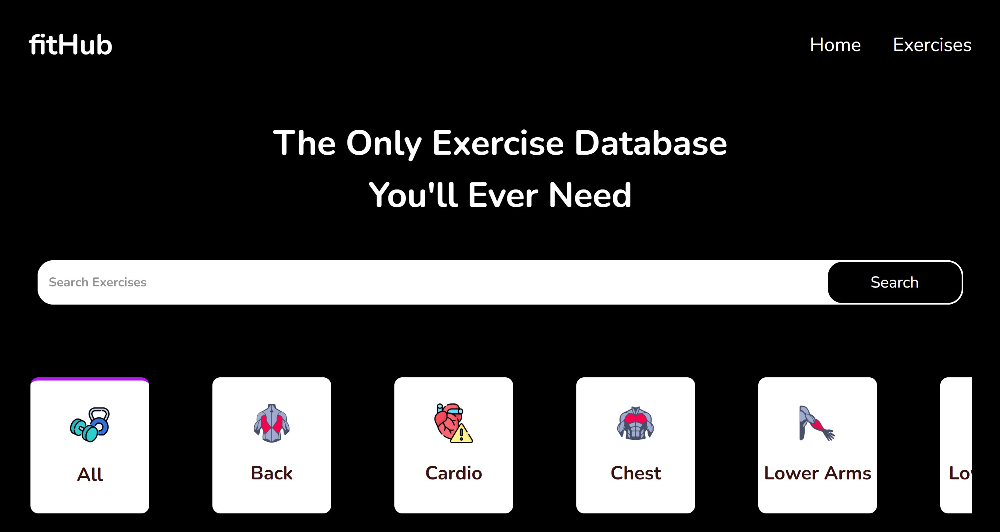

# fitHub

FitHub is a comprehensive exercise database. It provides users with access to a wide range of exercises, detailed exercise videos, and other fitness-related information. The application is designed to be responsive and user-friendly, ensuring a seamless experience across different devices.



[Demo](https://youtu.be/B7BnqMOZACA)

## Tech Stack

- **Frontend**: React, Material-UI
- **Backend**: ExerciseDB API, Youtube Search and Download (via RapidAPI)
- **Styling**: CSS, Material-UI
- **Deployment**: Vercel
- **Icons**: Custom icons
- **Version Control**: Git, GitHub
- **Tools**: VS Code (IDE), Postman (API testing), Git, npm

## Features

- Search for exercises by name, target muscle, equipment, and body part.
- View exercise videos and detailed information about each exercise.
- Responsive design for seamless use on mobile and desktop devices.
- Horizontal scrolling for exercise categories with mouse wheel support.

## Installation

### Prerequisites

- Node.js (v14 or higher)
- npm (v6 or higher)

### Steps

1. Clone the repository:

    ```bash
    git clone https://github.com/yourusername/fitHub.git
    cd fitHub
    ```

2. Install the dependencies:

    ```bash
    npm install
    ```

3. Create a `.env` file in the root directory and add your RapidAPI key:

    ```env
    REACT_APP_RAPID_API_KEY=your_rapidapi_key
    ```

4. Start the development server:

    ```bash
    npm start
    ```

The application should now be running on `http://localhost:3000`.

## Usage

- **Search Exercises**: Use the search bar to find exercises by name, target muscle, equipment, or body part. Press 'Enter' or click the 'Search' button to initiate the search.
- **View Exercise Details**: Click on any exercise card to view detailed information and related exercise videos.
- **Navigate**: Use the horizontal scrollbar to browse through different exercise categories. You can also use the mouse wheel for horizontal scrolling.
